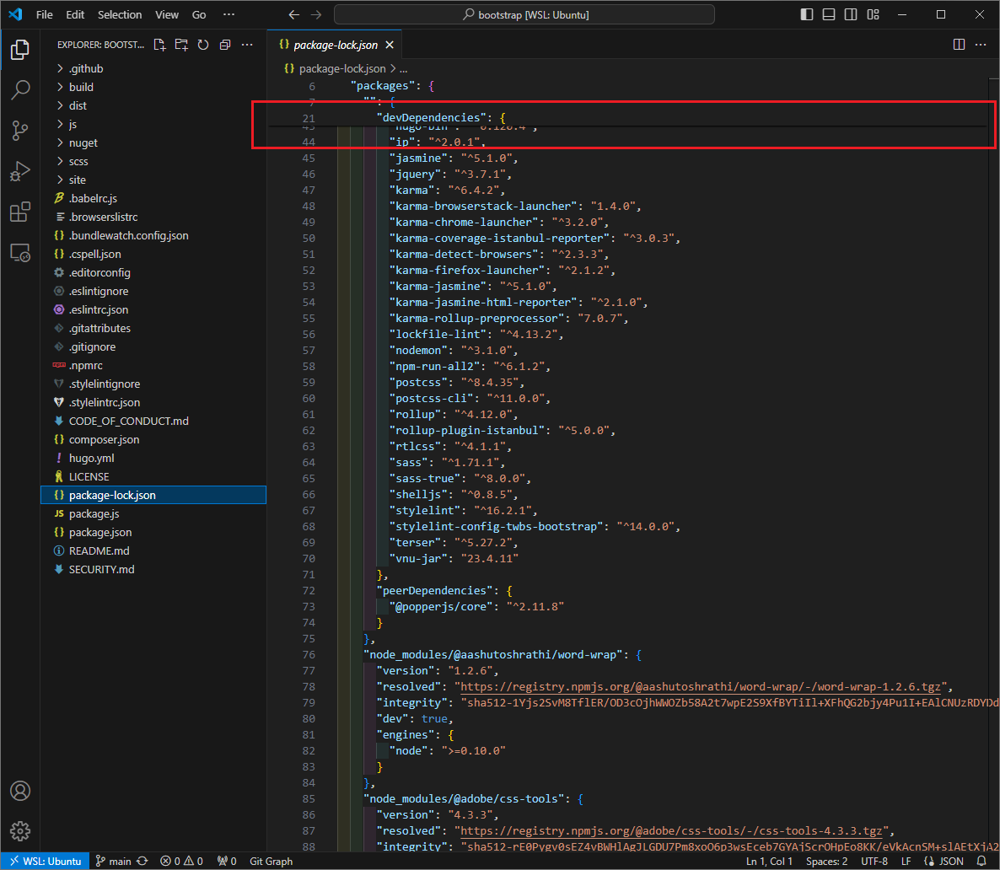
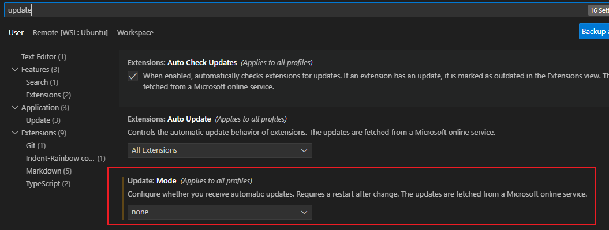
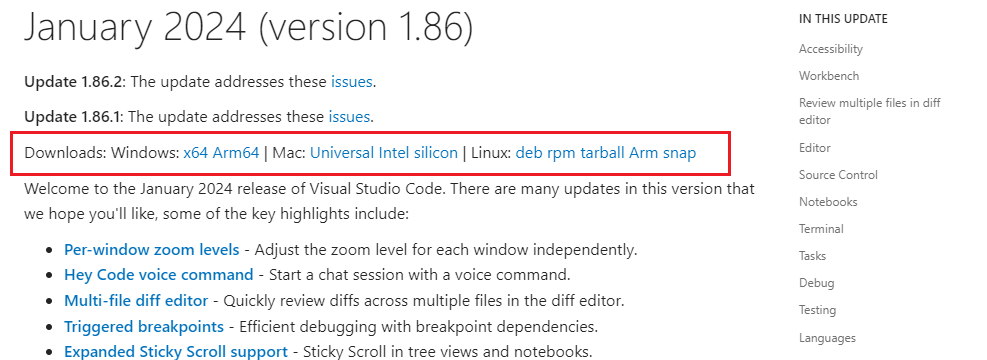

[TOP](/)

## VSCodeのエディターで、表示がおかしかったのでダウングレードした #1

### どんな感じで表示がおかしいか

- `1.87.0`で添付画像のように、21行目あたりからずれて表示されてしまう
- 必ず決まった箇所でずれて表示されるわけではなく、上方？でずれる模様

### ダウングレードした

- `1.87.0`から`1.86.2`へダウングレードした

#### 1.87.0

#### 1.86.2

### 現在のバージョンの確認方法

- 現在のバージョンは、VSCodeのメニューバーのHelpか、`code -v`で確認できる

### ダウングレード方法

1. 自動アップデートを`none`にする
2. ダウングレード先のバージョンのインストーラを取得する (今回は1.86)
  - [January 2024 (version 1.86)](https://code.visualstudio.com/updates/v1_86)
  - 現在は`VSCodeUserSetup-x64-1.86.2.exe`がダウンロードされる
3. インストーラを実行する
4. ダウングレードされているか、確認する

#### 自動アップデート

> Configure whether you receive automatic updates. Requires a restart after change. The updates are fetched from a Microsoft online service.

これを設定しないと再起動後に最新版のVSCodeで立ち上がってしまう？

#### January 2024 (version 1.86)

